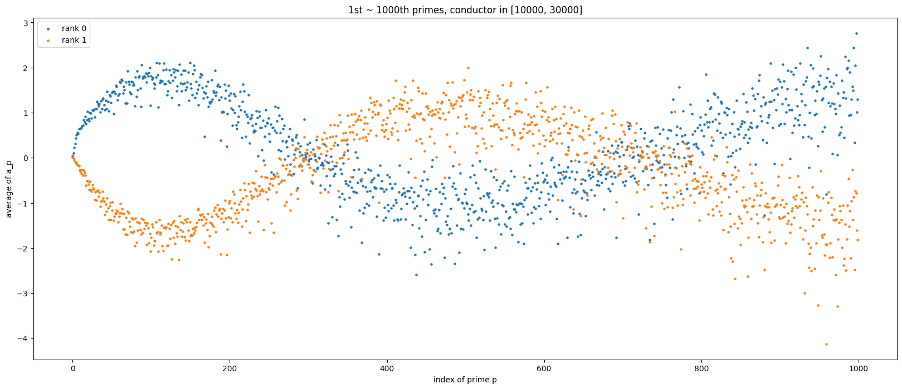

## Murmuration of Elliptic Curves 

The Jupyter notebooks generates the result from [HLOP24]. 

The paper [HLOP24] reports the _murmuration_ property of the elliptic curves. One of the result they report can be vaguely described as:

_"The Frobenius traces $(a_p)_{p \in\{2,3,\dots, p_n\}}$ can somehow encode the data of elliptic curve $E$, e.g. its rank $r_E$."_

Actually one can say further that there exist some oscillating property of the average of $a_p$ over the class of elliptic curves which ranges over a fixed window of conductors as follows. 

The blue and orange points represent the average of $a_p$ over the elliptic curves of conductor in $[10000, 30000]$ and of rank 0, 1, respectively. 

[HLOP24]: He, Y. H., Lee, K. H., Oliver, T., & Pozdnyakov, A. (2024). Murmurations of Elliptic Curves. Experimental Mathematics, 1–13. https://doi.org/10.1080/10586458.2024.2382361

## Prerequisite

### SageMath
The calculation is done in two steps; one is on the `SageMath` and the other is on the Python. You need both `SageMath` and `Python 3`.

This notebook runs with `SageMath 9.2` and `Python 3.10.13`; other Python 3 versions would be also compatible. 

Also, you need some python packages like `numpy`, `pandas`, `matplotlib`.

My environment is:
* `MacOS 15.2` (Sequoia),
* `SageMath` version `9.2` using `Python 3.8.5`,
* `Python 3.10.0` using `pip 21.3.1`.

### Cremona Database
You might need to install the Cremona database for your Sagemath. 

For example, on MacOS, the following command on the terminal will work: 

`$ sage -i database_cremona_ellcurve`

refer to the following [link on the database](https://doc.sagemath.org/html/en/reference/databases/sage/databases/cremona.html
).

### Data from LMFDB 
Frobeinus traces $a_p$ is computed in this notebook, but the label of the curves and the rank data can be obtained from LMFDB. 

1. Visit [this link](https://www.lmfdb.org/EllipticCurve/Q/?conductor=10000-99999).
2. Search the elliptic curves for the range of conductors you want.
3. Check `one` from the `Curves per isogeny class` dropdown menu.
4. Select the followings from the dropdown menu `Select` and download. You might need to click `determine the number of results` and wait for a while. 
    - `LMFDB curve label`: LMFDB label for each elliptic curve
    - `LMFDB class label`: isogeny class. Note that $E$ and $E'$ has the same rank if they are isogenous, and [HLOP24] uses the isogeny classes (not the isomorphism classes) to see the murmurations. 
    - `conductor`
    - `rank`
5. Locate the downloaded file; it should be a `txt` file.

## How to use

There are two `ipynb` files. 
- `1_ell_murmur_data_preparation.ipynb` calculates the Frobenius traces and serializes the data (i.e., keep the data for later use).
- `2_ell_murmur_visualization.ipynb` reads the serialized data and plots the result for desired conductor windows. One can change the size of prime sets and conductor window in this file. 
- I didn't upladed the data downloaded from LMFDB nor the serialized Frobenius traces. One should obtain them by oneself. 

## TODOS
- Other murmurations properties? (Modular forms, Dirichlet characters, etc.)
- Refactor the code 